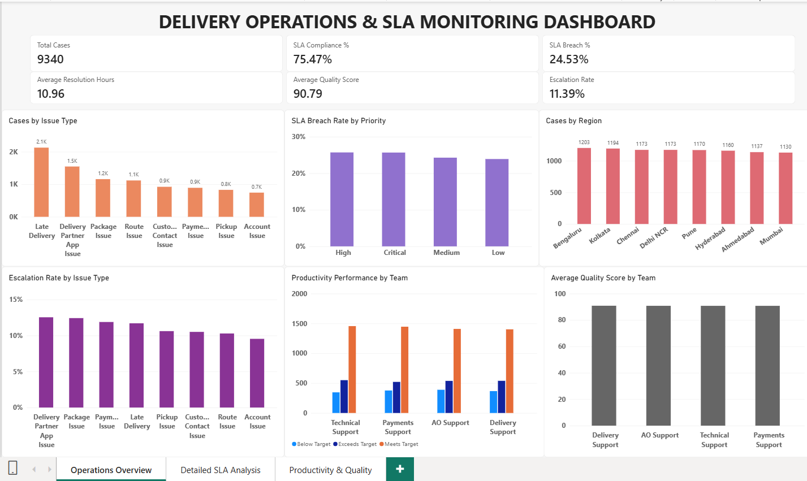
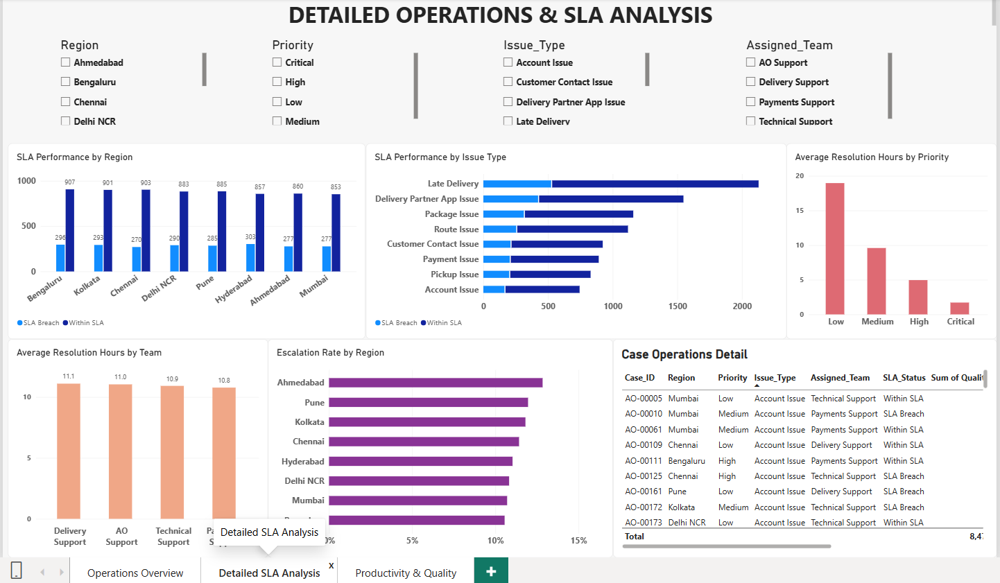
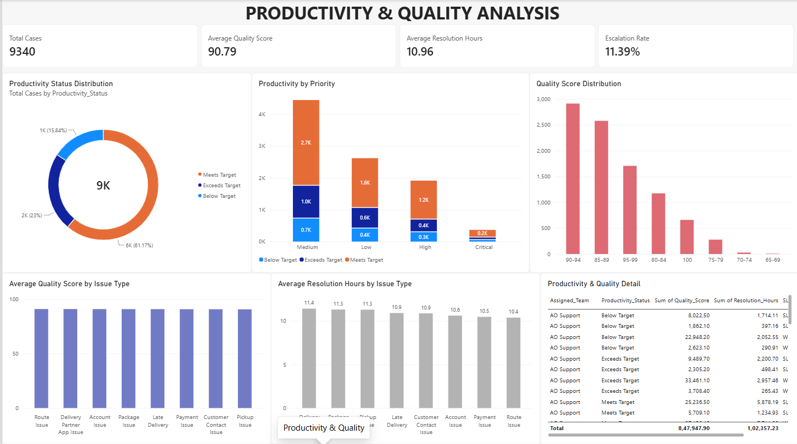

# Delivery Operations & SLA Monitoring Dashboard

## 📊 Project Overview

An end-to-end operations analytics project built using **Microsoft Excel and Power BI** to monitor delivery operations, SLA performance, productivity, quality, resolution time, and escalations.

The project analyzes **9,340 operational cases** across multiple regions, issue types, priorities, and assigned teams.

---

## 🎯 Business Objective

The objective of this project is to provide an interactive dashboard that helps operations teams:

- Monitor SLA compliance and SLA breaches
- Identify high-volume issue types
- Analyze operational performance across regions
- Compare assigned-team performance
- Monitor resolution time
- Track quality scores
- Analyze escalation patterns
- Identify productivity performance
- Support data-driven operational decisions

---

## 🛠️ Tools & Technologies

- **Microsoft Excel** – Data cleaning, analysis and initial KPI calculations
- **Power BI** – Interactive dashboard and data visualization
- **DAX** – KPI and business metric calculations
- **Power Query** – Data preparation and transformation

---

## 📁 Dataset

The dataset contains **9,340 operational cases** with information related to:

- Case ID
- Region
- Priority
- Issue Type
- Assigned Team
- SLA Status
- Resolution Hours
- Quality Score
- Escalation Status
- Productivity Status

---

## 📌 Key Performance Indicators

| KPI | Result |
|---|---:|
| Total Cases | 9,340 |
| SLA Compliance | 75.47% |
| SLA Breach | 24.53% |
| Average Resolution Hours | 10.96 |
| Average Quality Score | 90.79 |
| Escalation Rate | 11.39% |

---

# 📊 Dashboard

## Page 1 — Operations Overview

The first page provides a high-level overview of delivery operations.

### Key visuals

- Total Cases
- SLA Compliance %
- SLA Breach %
- Average Resolution Hours
- Average Quality Score
- Escalation Rate
- Cases by Issue Type
- SLA Breach Rate by Priority
- Cases by Region
- Escalation Rate by Issue Type
- Productivity Performance by Team
- Average Quality Score by Team

### Dashboard Preview



---

## Page 2 — Detailed Operations & SLA Analysis

The second page provides a more detailed operational analysis with interactive filters.

### Filters

- Region
- Priority
- Issue Type
- Assigned Team

### Key visuals

- SLA Performance by Region
- SLA Performance by Issue Type
- Average Resolution Hours by Priority
- Average Resolution Hours by Team
- Escalation Rate by Region
- Case Operations Detail

The detailed table provides case-level information including:

- Case ID
- Region
- Priority
- Issue Type
- Assigned Team
- Resolution Hours

### Dashboard Preview



---

## Page 3 — Productivity & Quality Analysis

The third page focuses on productivity and quality performance.

### Key analysis areas

- Productivity performance
- Productivity by priority
- Quality score distribution
- Quality performance by issue type
- Resolution time analysis
- Team-level productivity and quality
- Detailed operational performance

### Dashboard Preview



---

# 📈 Key Insights

Based on the dashboard analysis:

- **9,340 cases** were analyzed.
- Overall **SLA compliance was 75.47%**.
- **24.53% of cases breached SLA**.
- Average resolution time was **10.96 hours**.
- Average quality score was **90.79**.
- Overall escalation rate was **11.39%**.
- **Late Delivery** was the highest-volume issue type.
- SLA performance varied across different priority levels.
- Operational performance differed across regions and assigned teams.
- Productivity status varied across assigned teams.

---

# 💡 Business Value

The dashboard provides operations teams with a centralized view of operational performance.

It can be used to:

- Identify SLA performance gaps
- Monitor operational workload
- Compare team performance
- Identify high-volume issue categories
- Track resolution efficiency
- Monitor quality performance
- Identify escalation trends
- Support operational improvement initiatives

---

# 📂 Project Files

```text
delivery-operations-SLA-dashboard/
│
├── README.md
│
├── Delivery_Operations_Analysis.xlsx
│
├── Delivery_Operations_SLA_Dashboard.pbix
│
├── page1_operations_overview.png
├── page2_sla_analysis.png
└── page3_productivity_quality.png
